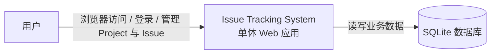
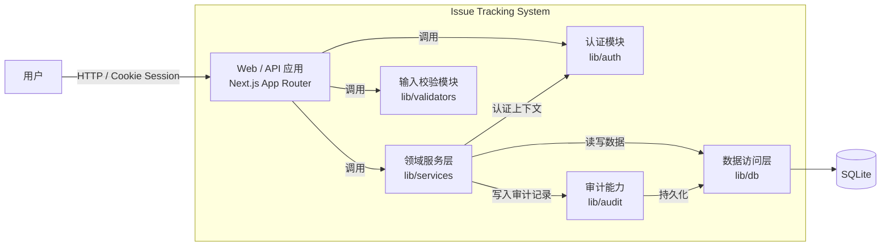

# Architecture

本文件定义实现约束。

## 系统形态

- 单体应用
- 单组织
- 单数据库（SQLite）
- 不拆分微服务
- 不引入消息队列
- 不引入搜索引擎

## 技术选型

- **Next.js**: 16.x (App Router)
- **React**: 19.x
- **TypeScript**: 6.x
- **Jest**: 30.x
- **ESLint**: 10.x (flat config with @next/eslint-plugin-next)
- **Tailwind CSS**: 4.x (CSS-first configuration)
- **Zod**: 4.x
- **SQLite** (via better-sqlite3): 11.x

要求:

- 严格遵循框架版本约束. 如果需要升级, 需同时修改本文档
- 不得引入新的后端框架
- 不得引入新的 ORM 框架
- 不得引入新的数据库系统
- 不得引入额外验证库（统一使用 Zod）

## 分层结构

目录结构必须包含：

```bash
/app
    /api
/lib
    /db
    /services
    /validators
    /errors
    /auth
    /audit
```

分层规则：

- UI 层不得包含业务逻辑
- UI 不得访问数据库
- API 仅负责请求处理与调用 service. 禁止实现业务逻辑, 禁止直接访问数据库
- 业务逻辑必须在 services 层
- 仅 lib/db 可访问 SQLite
- 所有外部输入必须经过 Zod 校验. 禁止跳过 validator 直接处理原始输入
- Zod Schema 是输入结构唯一来源
- 校验必须在进入 service 前完成

## 安全约束

所有 API 端点必须满足以下安全约束：

- 所有写操作必须要求登录（通过 `requireAuthenticatedUser()` 验证）
- 所有资源访问必须在 Service 层完成最终权限校验
- API 层不得直接信任 request 中的 userId / role / projectId
- 禁止在 API 层直接访问数据库（必须通过 Service 层）
- 所有外部输入必须经过 Zod 校验（路径参数、查询参数、请求体）
- 未登录返回 UNAUTHENTICATED (401)
- 权限不足返回 FORBIDDEN (403)
- 非法输入返回 VALIDATION_ERROR (400)
- 不得返回 passwordHash / session token / 内部错误细节 / SQL 细节

## 架构图

C1 System Context:



C2 Container Diagram:



C3 Component Diagram:

```mermaid
flowchart TB
    subgraph Web["Web / API 层"]
        AuthAPI["Auth API<br/>register / login / logout / me"]
        ProjectAPI["Project API<br/>create / list / detail"]
        ProjectMemberAPI["Project Member API<br/>add / remove / list"]
        IssueAPI["Issue API<br/>create / list / detail / batch / views"]
        IssueStatsAPI["Issue Stats API<br/>close reason stats / dashboard"]
        StateAPI["Issue State API<br/>state transition"]
        CommentAPI["Comment API<br/>create / list with mentions"]
        AssigneeAPI["Assignee API<br/>set / change / clear"]
        AuditLogAPI["Audit Log API<br/>get issue audit logs with pagination"]
        NotificationAPI["Notification API<br/>list / unread-count / mark read / batch read"]
    end

    subgraph Validation["校验层"]
        AuthValidator["Auth Validators"]
        ProjectValidator["Project Validators"]
        ProjectMemberValidator["Project Member Validators"]
        IssueValidator["Issue Validators<br/>(preset views, stats)"]
        StateValidator["State Validators"]
        CommentValidator["Comment Validators"]
        CommentMentionParser["Comment Mention Parser<br/>parse @ from content"]
        CommentMentionValidator["Comment Mention Validator<br/>validate project members"]
        AssigneeValidator["Assignee Validators"]
        NotificationValidator["Notification Validators"]
    end

    subgraph Services["服务层"]
        AuthService["Auth Service"]
        ProjectService["Project Service"]
        ProjectMemberService["Project Member Service"]
        IssueService["Issue Service<br/>(preset views, stats)"]
        IssueStateService["Issue State Service"]
        CommentService["Comment Service<br/>with mentions support"]
        AssigneeService["Assignee Service"]
        NotificationService["Notification Service"]
        AuditService["Audit Service"]
    end

    subgraph Infra["基础设施层"]
        AuthModule["Auth Context / Session"]
        DBLayer["DB Access Layer"]
    end

    subgraph Data["SQLite"]
        Users[("users")]
        Sessions[("sessions / auth session")]
        Projects[("projects")]
        ProjectMembers[("project_members")]
        Issues[("issues")]
        IssueComments[("issue_comments")]
        IssueCommentMentions[("issue_comment_mentions")]
        IssueAuditLogs[("issue_audit_logs")]
        Notifications[("notifications")]
    end

    AuthAPI --> AuthValidator
    AuthAPI --> AuthService

    ProjectAPI --> ProjectValidator
    ProjectAPI --> ProjectService

    ProjectMemberAPI --> ProjectMemberValidator
    ProjectMemberAPI --> ProjectMemberService

    IssueAPI --> IssueValidator
    IssueAPI --> IssueService

    IssueStatsAPI --> IssueValidator
    IssueStatsAPI --> IssueService

    StatusAPI --> StatusValidator
    StatusAPI --> IssueStatusService

    CommentAPI --> CommentValidator
    CommentAPI --> CommentService

    AssigneeAPI --> AssigneeValidator
    AssigneeAPI --> AssigneeService

    NotificationAPI --> NotificationValidator
    NotificationAPI --> NotificationService

    AuthService --> AuthModule
    AuthService --> DBLayer

    ProjectService --> AuthModule
    ProjectService --> DBLayer
    ProjectService --> ProjectMemberService

    ProjectMemberService --> AuthModule
    ProjectMemberService --> DBLayer

    IssueService --> AuthModule
    IssueService --> DBLayer
    IssueService --> AuditService
    IssueService --> ProjectMemberService

    IssueStateService --> AuthModule
    IssueStateService --> DBLayer
    IssueStateService --> AuditService

    CommentService --> AuthModule
    CommentService --> DBLayer

    AssigneeService --> AuthModule
    AssigneeService --> DBLayer
    AssigneeService --> ProjectMemberService

    NotificationService --> AuthModule
    NotificationService --> DBLayer
    CommentService --> NotificationService
    AssigneeService --> NotificationService

    AuditService --> DBLayer

    DBLayer --> Users
    DBLayer --> Sessions
    DBLayer --> Projects
    DBLayer --> ProjectMembers
    DBLayer --> Issues
    DBLayer --> IssueComments
    DBLayer --> IssueAuditLogs
    DBLayer --> Notifications
```



## 权限模型

角色：

- Admin
- Member
- Viewer
- Project Owner（项目所有者）
- Project Member（项目成员）

规则：

- 权限策略为硬编码
- 所有写操作必须鉴权
- 最终权限校验必须在 services 层执行
- 所有认证逻辑必须复用已有认证能力（位于 `./lib/service/auth）
- 必须通过统一方法获取当前用户信息（如 `getCurrentUser`）. 禁止从 request 中手动解析用户信息

项目访问控制：

- Project 创建者自动成为 Project Owner
- Project Owner 可添加/移除 Project Member
- Project Owner 和 Project Member 可访问该 Project 下的所有资源
- 非 Project 成员不可访问 Project 下的任何资源
- Issue assignee 必须是该 Project 的 Member
- Project 至少需要保留一名 Owner

## 并发控制

- Issue 更新必须使用乐观锁（updatedAt）
  - 所有更新操作（状态、指派、标题、描述）必须提供 `expectedUpdatedAt` 参数
  - 数据库层在更新前校验 `expectedUpdatedAt` 是否与当前记录一致
  - 不一致时抛出 `CONFLICT` 错误，包含当前 issue 数据
  - 状态变更必须原子执行
- Issue 状态变更必须通过统一状态机函数, 禁止直接修改状态字段
  - 非法转换必须抛出错误
- 发生冲突必须返回 CONFLICT 错误
- 禁止静默覆盖
- API 端点：`PATCH /api/issues/:id` 支持更新 title 和 description

## 审计日志

必须记录：

- 创建 Issue
- 状态变更
- 指派变更
- 标题或描述修改
- 删除评论
- 项目归档
- 角色变更
- 添加 Project 成员
- 移除 Project 成员
- 批量 Issue 操作（状态 / 指派）

规则：

- 主写入与审计写入必须在同一事务; 主操作成功等于审计日志存在; 主操作失败不得写入审计日志
- 审计日志只允许追加
- 审计日志不得修改或删除
- 审计日志必须在 service 层写入; 禁止在 API 层拼接或写入审计数据

## 错误模型

所有 API 必须返回统一结构：

{
code: string,
message: string,
details?: object
}

必须包含以下错误类型：

- UNAUTHENTICATED
- FORBIDDEN
- VALIDATION_ERROR
- NOT_FOUND
- INVALID_STATE_TRANSITION
- CONFLICT
- INTERNAL

规则：

- 必须使用明确错误码
- 不得泄露内部实现细节
- 错误必须可预测、可测试
- 所有 API 端点必须使用统一的错误处理函数 `handleApiError()`
- 错误处理逻辑集中在 `lib/errors/api-handler.ts`
- HTTP 状态码映射：401（UNAUTHENTICATED）、403（FORBIDDEN）、400（VALIDATION_ERROR/INVALID_STATE_TRANSITION）、404（NOT_FOUND）、409（CONFLICT）、500（INTERNAL）

## 数据规则

- SQLite 是唯一数据源
- 所有数据库操作集中在 lib/db
- 禁止在 UI 或 API 中直接执行 SQL
- 数据迁移必须可重复执行
- 索引策略：
  - Issue 表：projectId, status, assigneeId, createdAt
  - Notification 表：(userId, isRead), createdAt
  - AuditLog 表：issueId, createdAt
- 索引必须通过 migration 创建，使用 IF NOT EXISTS 保证幂等性

## 核心实体

### User (用户)
- id, email, name, role
- 用于系统认证和权限控制

### Project (项目)
- id, name, key, description, ownerId
- 组织 Issue 的基本单位

### Issue (问题)
- id, title, description, status, closeReason, projectId, createdById, assigneeId
- 核心业务实体

### IssueComment (评论)
- id, content, issueId, projectId, authorId, createdAt
- Issue 的评论内容

### CommentMention (评论提及)
- id, commentId, issueId, projectId, mentionedUserId, createdAt
- 评论中的 @ 提及记录
- 约束: commentId + mentionedUserId 唯一
- 级联删除: 评论删除时自动删除相关提及
- 仅允许提及 Project 成员

### AuditLog (审计日志)
- 记录关键操作行为

### Notification (通知)
- id, userId, type, issueId, commentId, projectId, isRead, createdAt
- 用户通知（提及、指派变更）
- 约束: userId 必须存在，type 为 MENTION 或 ASSIGNEE_CHANGED
- 级联删除: 用户/Issue/评论删除时自动删除通知
- 支持: 未读计数 / 批量标记已读 / 全部标记已读

### SavedView (自定义视图)
- id, userId, name, filtersJson, createdAt
- 用户自定义的 Issue 筛选条件保存
- 约束: userId 必须存在，name 在同一用户下唯一
- 级联删除: 用户删除时自动删除其保存的视图
- 支持: 创建/列表/删除视图，使用视图查询 Issue
